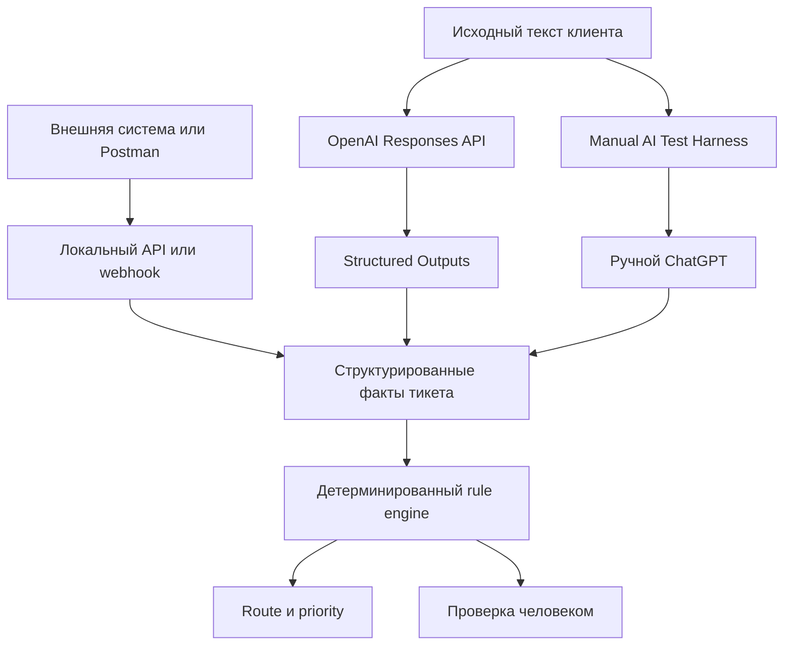
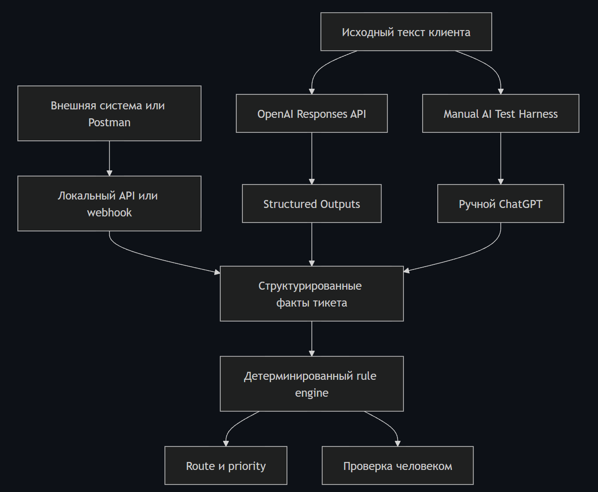
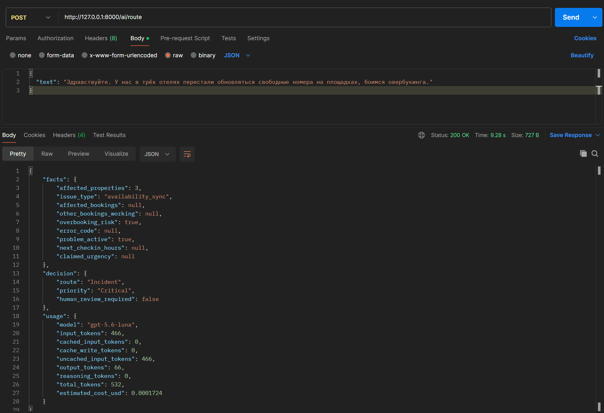
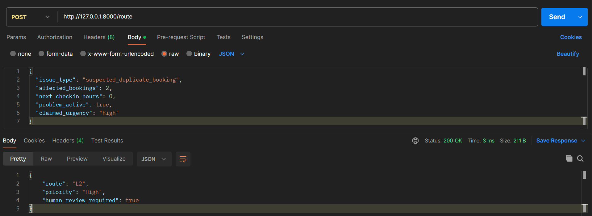

# Support Automation Lab

Локальный учебный MVP для маршрутизации тикетов гостиничной поддержки в вымышленном домене StayFlow. OpenAI извлекает и нормализует структурированные факты из текста, после чего детерминированные правила определяют `route`, `priority` и сигнал проверки человеком.

Проект разработан с AI-assisted development, но поведение, API-потоки и результаты тестов проверены вручную и автоматически.

## Проблема

Тикеты поддержки часто приходят неполными, эмоциональными или неструктурированными. MVP разделяет понимание тикета и бизнес-решение: неизвестные факты остаются неизвестными, а маршрутизация следует явным правилам.

## Что делает система

```text
входящий тикет/событие → извлечение фактов → структурированные факты → детерминированные правила
→ route / priority → проверка человеком, если это требуется
```

AI выполняет extraction + normalization — извлечение и нормализацию фактов из неструктурированного текста. Движок правил применяет политику маршрутизации. Human-in-the-loop — сигнал обязательной проверки человеком для рискованных действий.

## Архитектура





**Архитектура системы.** AI извлекает и нормализует факты из неструктурированного текста, после чего детерминированный rule engine определяет `route` и `priority`. Для потенциально рискованных действий предусмотрен human-review safety gate.

Автоматический путь по умолчанию использует `gpt-5.6-luna`, Responses API, строгий Structured Outputs и `store=false`. Ручной путь работает через copy/paste. Подробнее: [архитектура](docs/architecture.md), [AI-интеграция](docs/ai-integration.md), [ручной AI harness](docs/manual-ai.md) и [E2E-проверка](docs/end-to-end.md).

## Что реализовано

- Детерминированные правила маршрутизации поддержки.
- Локальный HTTP API: `POST /route`.
- Автоматическое AI извлечение фактов: `POST /ai/route`.
- Локальный webhook для события `ticket.created`.
- Ручной AI Test Harness: `GET /manual-ai`.
- Safety gate `human_review_required` для рискованных решений.
- Unit-, API-, webhook- и end-to-end-тесты.

## Пример

Три затронутых отеля, проблема availability sync и риск overbooking дают:

```json
{
  "route": "Incident",
  "priority": "Critical",
  "human_review_required": false
}
```



**Реальный AI E2E-сценарий.** Исходный текст клиента отправляется через `/ai/route` в OpenAI Responses API. Модель возвращает структурированные факты, после чего deterministic rule engine независимо определяет маршрут и приоритет. В ответе также отображаются token usage и ориентировочная стоимость AI-вызова.

Подозрение на duplicate booking при заселении сейчас даёт `L2` / `High` и `human_review_required: true`; никаких действий с бронированием это не запускает.



**Human-in-the-loop.** Подозрение на дублирование бронирований можно автоматически классифицировать как `L2 / High`, но система выставляет `human_review_required=true`: потенциально рискованное действие не должно выполняться без проверки человеком.

## Тестирование

Автоматический набор: **24/24 PASS**. Он покрывает правила, валидацию API, webhook, замокоренную OpenAI-интеграцию, доступность ручной страницы, human-review gate и E2E HTTP-потоки.

Live evaluation: 6/6 сценариев в двух последовательных прогонах после последнего prompt refinement; подробности, usage и ограничения — в [AI integration](docs/ai-integration.md). Это небольшой regression-набор, а не показатель production accuracy или прогноз стоимости.

## Как запустить локально

```powershell
cd support-automation-lab
py -m venv .venv
.\.venv\Scripts\python.exe -m pip install -r requirements.txt
# Задайте OPENAI_API_KEY в локальном окружении; никогда не помещайте ключ в репозиторий.
.\.venv\Scripts\python.exe -m src.api
```

`OPENAI_MODEL` необязателен и по умолчанию равен `gpt-5.6-luna`. Ключи читаются из переменных окружения и не хранятся в репозитории.

Доступные локальные endpoints:

- `POST http://127.0.0.1:8000/route`
- `POST http://127.0.0.1:8000/ai/route`
- `POST http://127.0.0.1:8000/webhook/ticket-created`
- `GET http://127.0.0.1:8000/manual-ai`

## Ограничения текущего MVP

- OpenAI-путь требует локального `OPENAI_API_KEY`; ручной harness остаётся запасным вариантом.
- Нет реальной HelpDesk-интеграции и production data.
- HTTP-сервер предназначен только для localhost/demo: нет базы данных, авторизации и production deployment.
- У webhook нет production-проверки подписи, идемпотентности и слоя повторных попыток.
- Approval workflow и автоматические destructive actions не реализованы.
- Проект не удаляет, не объединяет, не отменяет и не изменяет бронирования во внешних системах.

## Что именно я реализовал

- Спроектировал automation contract и детерминированную логику маршрутизации.
- Создал и протестировал локальные API- и webhook-потоки.
- Создал ручной AI harness для извлечения фактов.
- Добавил extraction и normalization через OpenAI Responses API и строгий Structured Outputs.
- Добавил human-review safety gate.
- Создал автоматические и E2E-тесты.
- Описал архитектуру, проверки и ограничения MVP.
