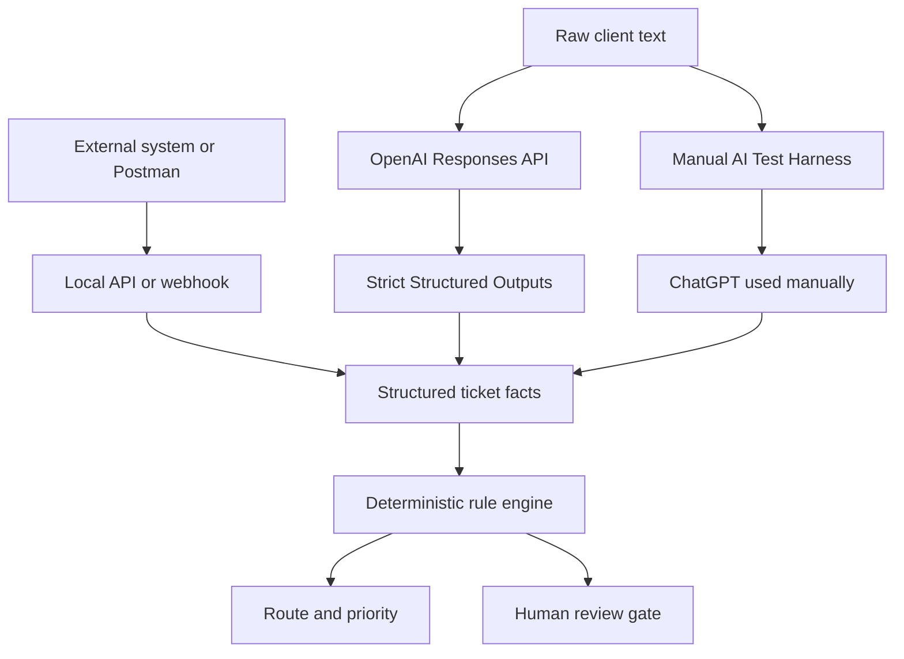

# Support Automation Lab

A local learning MVP for routing hotel-support tickets in a fictional StayFlow domain. It uses OpenAI to extract and normalize structured facts from raw text, then applies deterministic rules for route, priority, and a human-review safety signal. A manual ChatGPT harness remains available as an educational fallback.

Built with AI-assisted development, with manual verification of behavior, API flows, and test results.

## Problem

Support tickets can arrive with incomplete, emotional, or unstructured information. This MVP separates understanding the ticket from making a business decision: unknown facts stay unknown, and routing follows explicit rules.

## What the system does

```text
incoming ticket/event → fact extraction → structured facts → deterministic rules
→ route / priority → human review when required
```

AI interprets and normalizes unstructured text into the automation contract. The deterministic rule engine applies routing policy. The human-review gate signals when a risky automated action would need a person.

## Architecture



The automated path uses `gpt-5.6-luna` by default through the Responses API with strict Structured Outputs and `store=false`. The manual path remains copy/paste. See [architecture notes](docs/architecture.md), [AI integration](docs/ai-integration.md), [manual AI fallback](docs/manual-ai.md), and [E2E verification](docs/end-to-end.md).

## Implemented

- Deterministic support routing rules.
- Local HTTP API: `POST /route`.
- Automated AI routing: `POST /ai/route`.
- Local `ticket.created` webhook receiver.
- Manual AI extraction harness: `GET /manual-ai`.
- `human_review_required` safety gate for risky decisions.
- Unit, API, webhook, and end-to-end verification tests.

## Example

Three affected hotels with an availability-sync issue and overbooking risk return:

```json
{
  "route": "Incident",
  "priority": "Critical",
  "human_review_required": false
}
```

A suspected duplicate booking with immediate check-in returns `L2` / `High` and `human_review_required: true`; it does not trigger any booking action.

## Testing

The automated suite has **23/23 PASS**. It covers routing, API validation, webhook flow, mocked OpenAI integration, manual-page availability, the human-review gate, and E2E HTTP flows.

A separate real GPT-5.6 Luna evaluation passed **6/6** after prompt refinement fixed two observed extraction boundaries: an unsupported rate-plan issue was initially forced into the closest category, and immediate check-in was initially left without `next_checkin_hours = 0`. The six live calls used 3,137 tokens and had a measured estimated cost of about **$0.0010234 total** (**$0.0001706 per case**). This small set is regression evidence, not a production accuracy or cost forecast.

## Run locally

```powershell
cd D:\Studio\Projects\SupportAutomationLab\support-automation-lab
py -m venv .venv
.\.venv\Scripts\python.exe -m pip install -r requirements.txt
$env:OPENAI_API_KEY = "<set locally>"
.\.venv\Scripts\python.exe -m src.api
```

`OPENAI_MODEL` is optional and defaults to `gpt-5.6-luna`. Keys are read from environment variables and are not stored in the repository.

Successful `POST /ai/route` responses include top-level OpenAI token usage and `estimated_cost_usd`, separate from facts and routing. The estimate uses documented current Luna pricing and is not an invoice.

Available local endpoints:

- `POST http://127.0.0.1:8000/route`
- `POST http://127.0.0.1:8000/ai/route`
- `POST http://127.0.0.1:8000/webhook/ticket-created`
- `GET http://127.0.0.1:8000/manual-ai`

## Current limitations

- The OpenAI path requires a valid local `OPENAI_API_KEY`; the manual harness is the fallback.
- No real HelpDesk integration or production data.
- The HTTP server is localhost/demo-only, with no database, authentication, or deployment.
- The webhook has no production signature verification, idempotency, or retry layer.
- No approval workflow or automatic destructive actions.
- The project does not delete, merge, cancel, or edit bookings in external systems.

## What I actually built

- Designed the automation contract and deterministic routing logic.
- Built and tested the local API and webhook flow with AI-assisted development.
- Built a manual AI fact-extraction harness.
- Added automated extraction and normalization with the OpenAI Responses API and strict Structured Outputs.
- Added a human-review safety gate.
- Created automated and E2E tests.
- Documented the architecture, verification, and MVP limitations.
