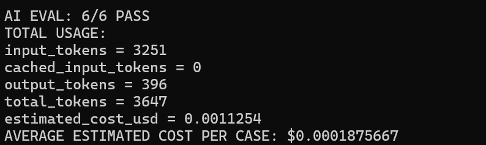

# OpenAI: извлечение фактов и маршрутизация

`POST /ai/route` принимает исходный текст тикета. OpenAI extractor нормализует явно выраженный смысл в существующий automation contract, а детерминированный rule engine принимает бизнес-решение.

```text
исходный текст → OpenAI Responses API → Structured Outputs → факты
→ rule_engine.py → route / priority / human_review_required
```

Модель по умолчанию — `gpt-5.6-luna`; её можно заменить через `OPENAI_MODEL`. Python SDK использует Responses API с `store=false`, `reasoning.effort=none`, без tools и со строгой JSON Schema, запрещающей лишние поля. `OPENAI_API_KEY` читается только из окружения.

AI выполняет extraction и normalization — извлечение и нормализацию фактов, а не маршрутизацию. Неизвестные факты остаются `null`. `problem_active` устанавливается только при явном смысле «проблема продолжается/устранена», а claimed urgency сама по себе не становится priority.

Extractor не должен выбирать ближайший issue type. `availability_sync` требует явной синхронизации доступности, inventory или свободных номеров между системами или каналами. Само наличие доступа к rate plan не переводится в эту категорию. Явное заселение «сейчас» нормализуется в `next_checkin_hours = 0`; одного слова «сегодня» недостаточно.

Успешный `/ai/route` также возвращает отдельную диагностику `usage` и `estimated_cost_usd`. Стоимость является оценкой, а не счётом; для неизвестной модели возвращается `null`, а не выдуманная сумма.

Технические ошибки остаются HTTP-ошибками: пустой текст, отсутствие ключа, authentication, quota/rate limit, ошибка сети/API, refusal, неполный или невалидный ответ не превращаются в `Clarify` или другое бизнес-решение.

Обычные тесты замокают границу OpenAI и не тратят кредиты. Реальная проверка extractor запускается отдельно:

```powershell
.\.venv\Scripts\python.exe scripts/eval_ai_extractor.py
```

## Результат live evaluation

Первая реальная проверка GPT-5.6 Luna прошла 4/6 и выявила две проблемы prompt: неподдерживаемая проблема rate plan ошибочно превращалась в `availability_sync`, а немедленное заселение не превращалось в `next_checkin_hours = 0`. После точечных исправлений повторная проверка прошла 6/6.

Позднее повторный запуск прошёл 5/6: фраза с явно текущим состоянием «Сейчас не могу...» оставила `problem_active = null`. Это не было проблемой taxonomy или closest-match классификации. Prompt уточнили общим temporal/current-state правилом: явно наблюдаемая сейчас проблема даёт `true`, явно устранённая — `false`, а прошлое событие без признака текущего состояния — `null`.

После этого два последовательных реальных прогона прошли **6/6**. В каждом: `input_tokens = 3251`, `cached_input_tokens = 0`, `output_tokens = 396`, `total_tokens = 3647`, `estimated_cost_usd = 0.0011254`; средняя ориентировочная стоимость одного случая — `$0.0001875667`.



**Live AI evaluation.** Небольшой regression-набор из 6 сценариев прошёл два последовательных прогона без ошибок после уточнения prompt. Для реальных OpenAI-вызовов измеряются token usage и ориентировочная стоимость. Этот набор не является статистической оценкой production accuracy.
