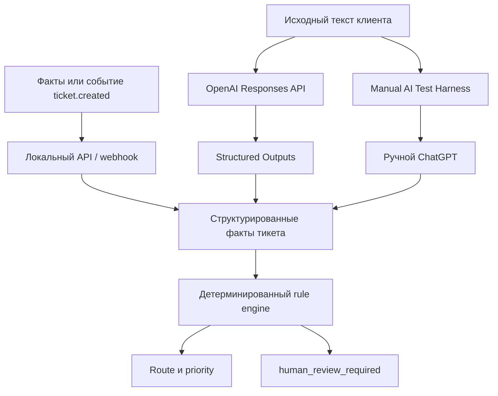

# Архитектура

## Компоненты

1. **Входы** — `POST /route` принимает структурированные факты, а `POST /webhook/ticket-created` достаёт вложенный ticket из локального события.
2. **Автоматическое AI extraction** — `POST /ai/route` использует OpenAI Responses API и Structured Outputs для извлечения и нормализации фактов. Решение он не выбирает.
3. **Ручной AI fallback** — локальный harness формирует prompt; пользователь вручную обменивается им с ChatGPT и вставляет JSON фактов.
4. **API/webhook-слой** — передаёт структурированные факты в rule engine и возвращает JSON. Политики маршрутизации здесь нет.
5. **Rule engine** — применяет детерминированные правила и возвращает `route`, `priority` и `human_review_required`.
6. **Human review gate** — отмечает рискованные автоматические действия для человека; это не approval workflow и никаких действий не выполняет.
7. **Результат** — JSON с фактами и решением для локального клиента.

Простыми словами: AI понимает и нормализует текст, rule engine применяет политику, а human review предотвращает небезопасные автоматические действия. Это localhost MVP в вымышленном домене StayFlow: реальной HelpDesk-интеграции, production data, базы, deployment, approval workflow и destructive booking actions нет.
