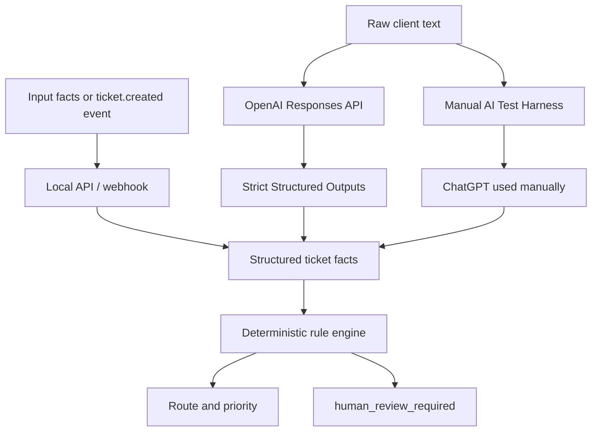

# Architecture

## Components

1. **Inputs** — `POST /route` accepts structured facts; `POST /webhook/ticket-created` extracts a nested ticket from a local event.
2. **Automated AI extraction** — `POST /ai/route` uses the OpenAI Responses API and strict Structured Outputs to extract and normalize facts. It does not choose the decision.
3. **Manual AI fallback** — the local harness copies a prompt. The user manually exchanges it with ChatGPT and pastes facts JSON back.
4. **API/webhook layer** — passes structured facts to the rule engine and returns JSON. It does not contain routing policy.
5. **Rule engine** — applies deterministic routing rules and returns `route`, `priority`, and `human_review_required`.
6. **Human review gate** — flags risky automated actions for a person; it is not an approval workflow and performs no action.
7. **Outputs** — JSON facts plus decisions for local callers.

In plain language: AI interprets and normalizes unstructured text, the rule engine applies policy, and human review prevents unsafe automated actions. This is a localhost MVP in a fictional StayFlow support domain: no real HelpDesk integration, production data, database, deployment, approval workflow, or destructive booking action exists.
